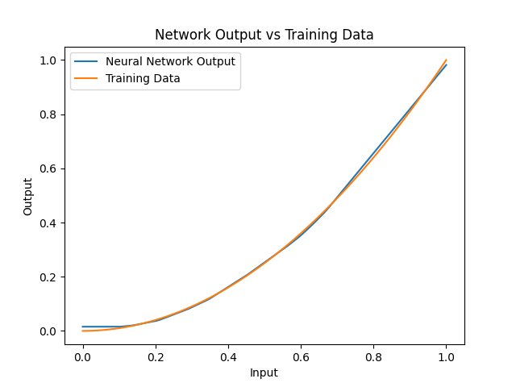
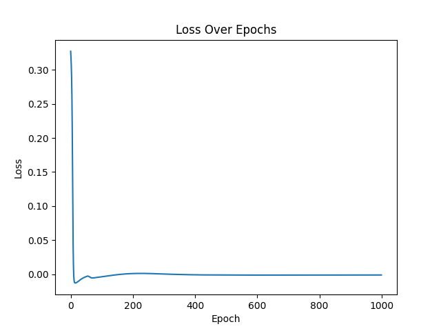
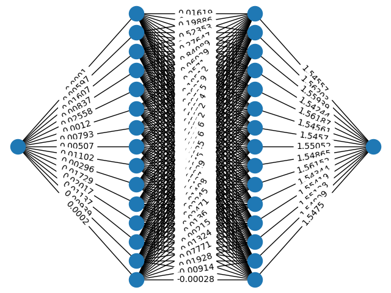

# AMP - Artificial Mind Project

## Background

This project was inspired by the book _Neural Networks From Scratch_ by Harrison Kinsley & Daniel Kukiela. This project is an attempt to implement the ideas and concepts presented in the book independently of his implementation. The main purpose of this project was to develop a deeper understanding of the fundamentals of neural networks through a practical approach. The neural network was implemented using classes to clearly define the separate aspects of a neural network and how they work together.

#

## Setup

The neural network is structured through a hierarchical system. The network object consists of layer objects (split into categories of input, deep, and output). The layer objects consist of neurons. The network object then interconnects all the neurons between layers, forming a fully connected network. It also initializes the starting (randomized) weights and biases of all the neurons and synapses. Finally, the network object defines the activation functions for each layer. A neuron object stores a list of the neurons in the previous layer, a list of the weights between the current neuron and each neuron in the previous layer, the bias, a cached value from the previous forward pass, and a cached delta value from the previous backward pass.

#

## How it works

The forward method of the layer essentially takes the dot product between the vector of inputs (or outputs of the previous layer) and the weights for each neuron of the next layer and adds the bias. The value is then passed into an activation function (defined per layer) and the result will then be stored as the current value of the corresponding neuron in the next layer.

The forward method of the network object runs this pass for all the layers until the output layer has its set of results.

The backward method of the network object takes the gradient of the loss of the network with respect to each weight and bias. This is done by taking the chain rule of the neural network's loss with respect to each weight and bias. That may sound difficult, but since we know the variables that factor into the derivative of a single weight: the error, the activation function derivative, and the cached value of the previous neuron connecting that weight, we can grab these values and systematically calculate the gradient on the loss of the neural network.

#

## Challenges Encountered

Of course, the above sounds easier than it is. In writing this implementation, the reality was much more problematic. It's very easy to misunderstand how backpropagation works and multiply the wrong values or know with values to add and which to subtract (changes whether you're learning to get better or worse). Also, because I did this using objects and not matrix multiplication, there was heavy use of for-loops, which also makes it easier to mix up variables.

Another problem I encountered (this was much earlier in the implementation process), which I find pretty amusing, is that my neuron initialization function was duplicating pointers. What that means is, when I assign a default parameter to a newly generated neuron object, the computer was defining the value by a pointer to a certain location in the computer's memory. However, when I had systematically generated many neuron objects, the computer was giving all these objects, the same pointer to a memory location. So, when I go to change weights or add more neurons, the same modification happens to every neuron in the network, which we don't want. This was fixed by having the default initialization parameters be _None_ and modifying them in the layer initialization step.

#

## What Made it Easier

Due to the complex nature of neural networks, it makes it very difficult to understand what it's doing and even harder to recognize malfunctions within the network. To combat this issue, there are a few standard features of neural networks that I implemented that provide a better understanding of what's happening.

The first thing I implemented is a network visualizer. This essentially uses the NetworkX library to plot the network as a multi_bipartite graph and the weight values between every neuron. This allowed me to find any anomalies in how the weights were changing or weird network behavior that didn't allow it to learn properly. This is only helpful on smaller networks as it can get very cluttered and impossible to see what's happening with larger networks.

The next thing I implemented was a plot function. This only works well on one-input, one-output neural networks because they can be plotted on a two-dimensional graph. The function plots the original training data, then runs a series of numbers within a certain range as inputs to the network (independent variables), and measures the output of the network as a result (dependent variables). Then, the network can essentially be plotted to see how it has fit the training data.

The final thing I implemented was a loss/epoch visualizer. An epoch is when the network has trained over the entire training dataset once. So, I stored the value for loss each time the network did a backward pass and took the average of the loss throughout one epoch. Then, plotted the value throughout the number of epochs that we trained on. This plot can tell you if the network is learning well or if it's getting stuck at local minima while training. It also gives you an idea of how many epochs to train on since normally, there's a sharp decline in loss and then a plateau.

#

## Conclusion

Overall, this was a very fun and educational project to work on. I would recommend it if you would like to gain a deeper understanding of neural networks. I would still recommend doing the object-oriented approach over matrix multiplication just because it allows you to struggle with the details of what the neural network is doing. I believe it provided me with a better understanding of how it's all connected over the other approach. I also haven't tried the matrix approach, so it's understandable if you think otherwise.

#

## Sample Run

Below is a sample run of a neural network consisting of one input, two hidden layers of 15 neurons, and one output, fitting to y = x2. The parameters were as such: epochs = 1000, learning rate for weights = 0.1 _ (1500 - epoch) / 1500, learning rate for biases = 0.0001 _ (1500 - epoch) / 1500
 

### Below are some visual representations of the network described above

